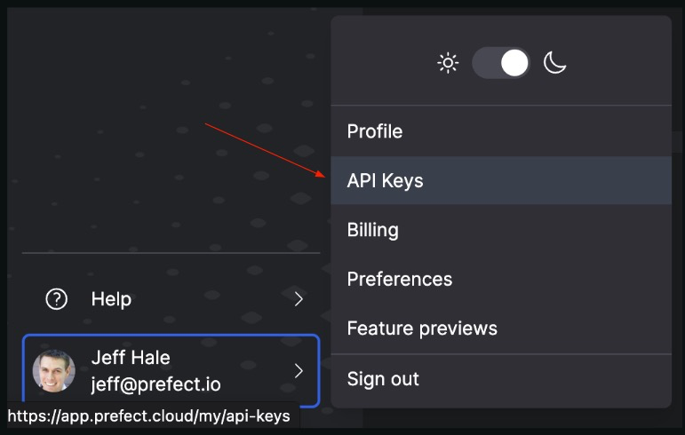

## [Login to Cloud](https://docs.prefect.io/latest/cloud/connecting/#log-into-prefect-cloud-from-a-terminal)

```bash
prefect cloud login
```
Select **Log in with a web browser**


#### Or manually login with API key



Find trouble shooting tips for login errors [here](https://docs.prefect.io/latest/cloud/connecting/#prefect-cloud-login-errors)!

## [Change Workspaces](https://docs.prefect.io/latest/cloud/connecting/#change-workspaces)
```bash
prefect cloud workspace set
```
Then select the desired workspace from list.

## [Prefect Profiles](https://docs.prefect.io/latest/guides/settings/#configuration-profiles)
Prefect allows you to persist settings instead of setting an environment variable each time you open a new shell. Settings are persisted to profiles, which allow you to move between groups of settings quickly.

To create a profile:
```bash
prefect profile create test
```

To switch to a selected profile:
```bash
prefect profile use test
```

Profiles are stored by default in your PREFECT_HOME directory:
```bash
vim ~/.prefect/profiles.toml
```

Example `profiles.toml` file:

```toml
active = "default"

[profiles.local]
PREFECT_API_URL = "http://127.0.0.1:4200/api"

[profiles.default]
PREFECT_API_KEY = "pnu_----replace-me----"
PREFECT_API_URL = "https://api.prefect.cloud/api/accounts/--replace-me--/workspaces/--replace-me--"

[profiles.staging]
PREFECT_API_KEY = "pnu_----replace-me----"
PREFECT_API_URL = "https://api.prefect.cloud/api/accounts/--replace-me--/workspaces/--staging-workspace-replace-me--"
PREFECT_LOGGING_LEVEL = "DEBUG"

[profiles.n]
PREFECT_API_KEY = "pnu_----replace-me----"
PREFECT_API_URL = "https://api.prefect.cloud/api/accounts/--replace-me--/workspaces/--n-workspace-replace-me--"
```