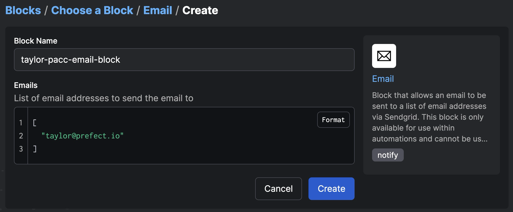
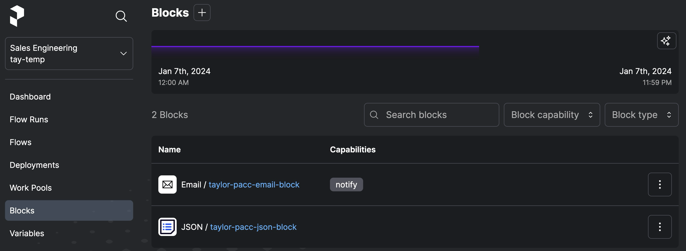
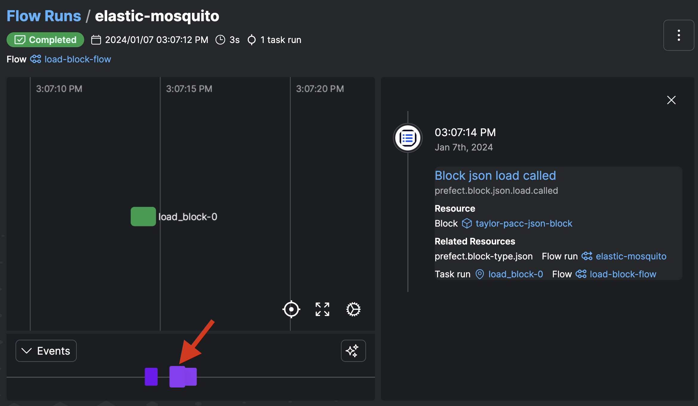
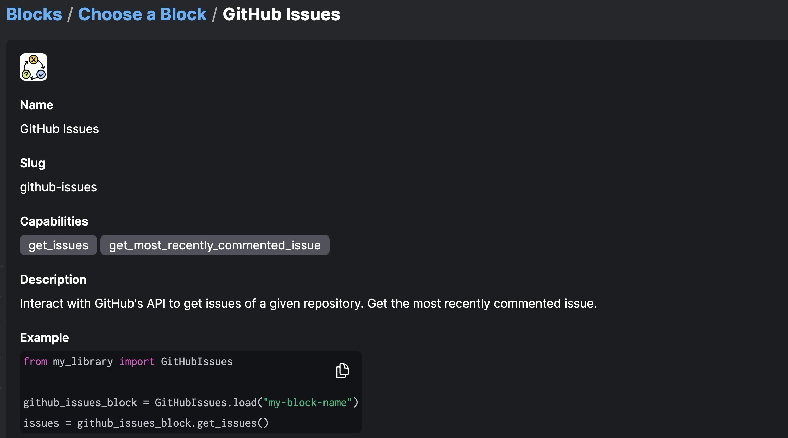

# Blocks and Integrations Quickstart

[Blocks](https://docs.prefect.io/latest/concepts/blocks/) are a primitive within Prefect that enable the **storage of configuration** and provide an interface for interacting with external systems.

Blocks expose **methods** (aka: capabilities) that provide pre-built functionality for performing actions against an external system. 

For example, they can be used to: 
- download data from or upload data to an S3 bucket
- query data from or write data to a database
- send a message to a Slack channel
- and much more

Block types can originate from:
1. Prefect provides a broad range of popular [built-in block types](https://docs.prefect.io/latest/concepts/blocks/#prefect-built-in-blocks).
2. [Prefect Integrations](https://docs.prefect.io/latest/integrations/) are libraries that often contain additional [block types](https://docs.prefect.io/latest/concepts/blocks/#blocks-in-prefect-integrations).
3. Create a [custom block type](https://docs.prefect.io/latest/concepts/blocks/#creating-new-block-types). Simply define a python class that subclasses [`Block`](https://docs.prefect.io/latest/api-ref/prefect/blocks/core/#prefect.blocks.core.Block).


---

### 0. Check out [Prefect's Integration Libraries](https://docs.prefect.io/latest/integrations/).
Prefect integrations are organized into collections of pre-built tasks, flows, block types and more that are installable as PyPI packages.

#### Interested in contributing an integration?
- [Contribution Guide](https://docs.prefect.io/latest/integrations/contribute/)
- [PrefectHQ/prefect-collection-template](https://github.com/PrefectHQ/prefect-collection-template)
- [Developing a New Worker Type](https://docs.prefect.io/latest/guides/deployment/developing-a-new-worker-type/)


### 1. Find the blocks page in the UI and click the `+` button create an `Email` block.

You'll use this block during the automation module's lab.

### 2. [Create and save another block with Prefect's Python SDK.](https://docs.prefect.io/latest/concepts/blocks/#instantiating-blocks)
This is an alternative to creating a block using a form in the UI as we did in the last step.

Create a JSON block:

`create_block.py`

```python
from prefect.blocks.system import JSON

my_new_block = JSON(value={"the_answer": 42})
my_new_block.save("taylor-pacc-json-block", overwrite=True)
```

```bash
python create_block.py
```

You should now have two blocks like these in your workspace, one of type `Email` the other of type `JSON`:


### 3. [Load the block in your flow code.](https://docs.prefect.io/latest/concepts/blocks/#loading-blocks)

```python
from prefect import flow, task
from prefect.blocks.system import JSON

@task
def load_block():
    jb = JSON.load("taylor-pacc-json-block")
    my_dict = jb.value

    print(my_dict)

@flow(log_prints=True)
def load_block_flow():
    load_block()

if __name__ == "__main__":
    load_block_flow()
```

Check out the flow run in the UI. You can see that _Prefect is tracking when a block's method is called_. We will learn more about Prefect events in an upcoming module.


### 5. Optional: [Create a custom block type.](https://docs.prefect.io/latest/concepts/blocks/#creating-new-block-types)

To create a custom block type, define a class that subclasses [`Block`](https://docs.prefect.io/latest/api-ref/prefect/blocks/core/#prefect.blocks.core.Block). The Block base class builds off of Pydantic's BaseModel, so custom blocks can be [declared in the same manner as a Pydantic model](https://docs.pydantic.dev/latest/concepts/models/#basic-model-usage).

1. Inherit from [`Block`](https://docs.prefect.io/latest/api-ref/prefect/blocks/core/#prefect.blocks.core.Block) class and add attributes
2. Add methods (aka: capabilities)
3. Add class-level details:
    - Add the block type's name `_block_type_name` and capabilities `_block_schema_capabilities`
    - Add `Examples: ` in the docstring to render in the UI.
    - Add a logo `_logo_url`
4. Register your block type:
    ```bash
    prefect block register --file custom_block.py
    ```
5. Consider open sourcing your custom block type.
6. Find examples of production-grade block types in Prefect's source code and integration libraries, including the [SlackWebhook](https://github.com/PrefectHQ/prefect/blob/d3eea3f02ffcb74f0877b7f96f674bdce97fa95d/src/prefect/blocks/notifications.py#L86C46-L86C46) type and the the [S3Bucket](https://github.com/PrefectHQ/prefect-aws/blob/main/prefect_aws/s3.py#L395C11-L395C11) type.

### Here is a simple example of a custom block type:

`my_custom_block_type.py`
```python
from prefect.blocks.core import Block
import requests
import datetime

class GitHubIssues(Block):
    """
    Interact with GitHub's API to get issues of a given repository.
    Get the most recently commented issue.

    Examples:
        ```python
        from my_library import GitHubIssues

        github_issues_block = GitHubIssues.load("my-block-name")
        issues = github_issues_block.get_issues()
        ```
    """
    username: str
    repo: str
    state: str = 'open'
    _block_type_name = "GitHub Issues"
    _block_schema_capabilities = ["get_issues", "get_most_recently_commented_issue"]
    _logo_url = "https://static.vecteezy.com/system/resources/previews/014/802/399/original/daily-flow-issues-organization-realization-flat-color-icon-icon-banner-template-free-vector.jpg"

    def _construct_url(self) -> str:
        return f"https://api.github.com/repos/{self.username}/{self.repo}/issues?state={self.state}"

    def get_issues(self) -> list:
        url = self._construct_url()
        response = requests.get(url)
        response.raise_for_status()  # Will raise an exception if the status code is not 200
        return response.json()
    
    def get_most_recently_commented_issue(self) -> dict:
        issues = self.get_issues()
        most_recent_issue = max(issues, key=lambda issue: datetime.fromisoformat(issue['updated_at'].rstrip("Z")))
        return most_recent_issue
```


Register Your Block

```bash
prefect block register --file my_custom_block_type.py
```


The Result:


To delete this block type:
```bash
prefect block type delete github-issues
```

#### [Design Philosophy Behind Blocks](https://medium.com/the-prefect-blog/supercharge-your-python-code-with-blocks-ca8a58128c55)
Today there are many low-code data integration tools - “connectors” to popular applications. These tools are great for setting up connections to common systems, but they’re not code-first, or even code-second. It can be complex to do anything custom with these tools.

Low-code connectors often come in two kinds - sources and destinations. That’s great for straightforward ELT pipelines, but modern dataflows don’t just extract and load data. They write intermediate outputs, call out to web services, transform data, train models, set up job-specific infrastructure, and much more.

Prefect’s Blocks offer the advantages of low-code connectors with a first class experience in code. The code first approach means Blocks are connectors for code that can go beyond source and destination.

With custom block types, as your data platform evolves, your building blocks don’t have to be replaced. Instead, they can gain new capabilities.
