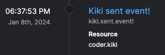

Create a webhook
Create a custom event

State change hooks
# Custom Events, Event Webhooks, and State Change Hooks Quickstart

There are two ways to get things that happen outside of Prefect into your workspace's event feed, Event Webhooks, and Custom Emitted Events.

## Create and call an [Event Webhook](https://docs.prefect.io/latest/guides/webhooks/).
Webhooks are great for getting events into Prefect from outside of a Python environment.

1. Find the Event Webhooks page and create an Event Webhook.
    
2. Copy the Webhook URL and call the endpoint from your terminal:

    ```bash
    curl https://api.prefect.cloud/hooks/your_slug_here
    ```
3. Navigate to the events page and find the Webhook called event.
    
4. Optional: Create a [dynamic webhook event](https://docs.prefect.io/latest/guides/webhooks/#dynamic-webhook-events)
    Here is a [blog post](https://www.prefect.io/blog/github-issues-prefect-marvin) with a great example use case of dynamic webhook events.

## [Emit a custom event](https://docs.prefect.io/latest/concepts/events/#event-sources)

1. Run this python function to emit an event:
    ```python
    from prefect.events import emit_event

    def some_function(name: str="kiki") -> None:
        print(f"hi {name}!")
        emit_event(event=f"{name}.sent.event!", resource={"prefect.resource.id": f"coder.{name}"})

    some_function()
    ```
2. Find the event in the event feed.
    


# [State Change Hooks](https://docs.prefect.io/latest/concepts/states/#state-change-hooks)

1. Add a state change hook to a flow:
    ```python
    from prefect import flow

    def my_success_hook(flow, flow_run, state):
        print("Flow run succeeded!")

    @flow(on_completion=[my_success_hook])
    def my_flow_a():
        return 42

    my_flow_a()
    ```
2. Now create a downstream flow and deployment:
    ```python
    from prefect import flow

    def my_success_hook(flow, flow_run, state):
        print("Flow run succeeded!")

    @flow(on_completion=[my_success_hook])
    def my_flow_a():
        return 42

    my_flow_a().deploy(#TODO: add trigger)
    ```

3. Emit an event from your state change hook.